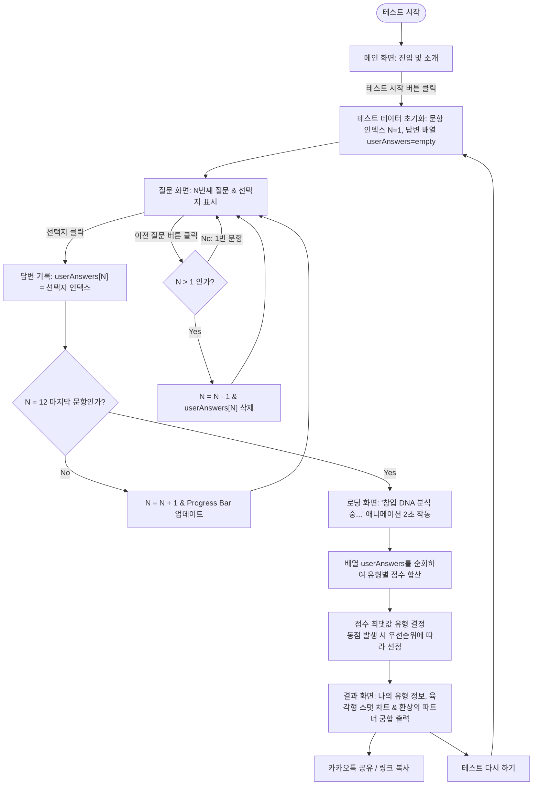

# [기획서] 대학생 창업 캠프용 창업 성향 테스트 (Startup Personality Test)
**작성일**: 2026년 7월 13일  
**기획자**: 대학생 창업 교육 전문 기획자 (AI 에이전트)  
**상태**: 초안 (Draft)  

---

## 1. 프로젝트 개요 (Overview)

### 1.1 배경 및 필요성
대학생 창업 캠프의 첫 단계는 대개 **'팀 빌딩(Team Building)'**입니다. 성공적인 창업팀을 구성하기 위해서는 단순히 친한 사람끼리 뭉치는 것이 아니라, 서로의 강점을 극대화하고 약점을 보완해 줄 수 있는 **다양한 성향의 구성원**이 조화롭게 섞여야 합니다.  
본 프로젝트는 대학생 참가자들이 쉽고 재미있게 자신의 창업 성향을 진단하고, 결과에 나타난 '환상의 파트너' 정보를 바탕으로 최적의 팀원을 탐색 및 매칭할 수 있도록 돕는 웹 어플리케이션입니다.

### 1.2 프로젝트 목적
- **자기 객관화**: 참가자 스스로가 창업 환경에서 어떤 역할을 가장 잘 수행할 수 있는지 인지합니다.
- **팀 매칭 활성화**: 각 성향별 궁합(환상의 파트너) 정보를 제공하여 캠프 내에서 자연스러운 팀 빌딩 네트워킹을 유도합니다.
- **이탈 방지 및 참여도 향상**: 캐주얼하고 세련된 인터페이스와 공감 가는 문항을 통해 참가자들의 몰입도를 극대화합니다.

### 1.3 서비스 타깃
- **주 타깃**: 창업 캠프/해커톤/동아리에 참여하는 대학생 (10대 후반 ~ 20대 중반)
- **부 타깃**: 대학생 창업 교육 프로그램을 운영하는 교육 기획자 및 퍼실리테이터

---

## 2. 서비스 핵심 원칙 및 기능 요구사항

> [!IMPORTANT]
> **핵심 원칙: 간편함과 재미 (Keep It Simple & Fun)**
> - 별도의 회원가입이나 개인정보 입력 없이 **즉시 테스트를 시작**할 수 있도록 진입 장벽을 완전히 없앱니다.
> - 질문 개수는 **12개**로 제한하여, 약 2~3분 내에 지루함 없이 완료할 수 있도록 설계합니다.

### 2.1 사용자 여정 및 상세 화면 흐름 (User Journey & Screen Flow)

사용자가 웹사이트에 진입하여 테스트를 마치고 공유하기까지의 상세 단계와 시스템 내부 흐름은 다음과 같습니다.

#### 1) 화면별 사용자 행동 및 시스템 반응 (Step-by-Step Flow)
1. **[화면 1] 메인/시작 화면 (Intro)**
   - **사용자**: 서비스 목적과 소개글을 확인하고, **'테스트 시작하기'** 버튼을 클릭합니다.
   - **시스템**: 문항 데이터와 유형별 점수 변수를 초기화하고 1번 질문 화면으로 부드럽게 이동합니다.
2. **[화면 2] 테스트 진행 화면 (Test: 12개 질문 반복)**
   - **사용자**:
     - 매 화면 제공되는 질문을 읽고 **3~4개의 선택지 중 자신에게 가장 어울리는 것**을 클릭합니다.
     - 답변을 잘못 선택했거나 수정하고 싶다면 화면 하단의 **'이전 질문' 버튼**을 클릭하여 직전 질문 단계로 돌아갈 수 있습니다.
   - **시스템**:
     - 사용자가 답변을 선택하면 해당 선택 이력을 저장하고 다음 문항으로 이동합니다.
     - 사용자가 '이전 질문' 버튼을 누르면 직전 질문 화면으로 되돌아가며, 해당 문항의 이전 답변 기록을 삭제/취소합니다.
     - 진행 상황 바(Progress Bar)를 업데이트하여 현재 위치(`현재 문항 수 / 12`)를 시각적으로 보여줍니다.
     - 페이드아웃 및 페이드인 애니메이션 효과와 함께 문항을 렌더링합니다.
     - 12번째 문항 답변이 완료되면 결과 연산 처리를 시작하며 분석 화면으로 이동합니다.
3. **[화면 3] 결과 분석 로딩 화면 (Loading)**
   - **사용자**: 결과를 기대하게 만드는 로딩 메시지(*"당신의 창업 DNA를 분석하는 중입니다..."*)와 함께 애니메이션을 감상합니다.
   - **시스템**: 1.5초~2초간 대기하며 사용자 응답 데이터를 집계하여 가장 높은 점수를 얻은 최종 유형을 도출합니다. (동점 발생 시 내부 우선순위 정책에 따라 1순위 유형 지정)
4. **[화면 4] 결과 보기 화면 (Result)**
   - **사용자**: 자신의 창업 성향 분석 카드, **육각형 성향 차트 (Radar Chart)**, 롤모델 정보, 보완할 점, 추천 역할을 확인하고, 자신과 시너지를 낼 수 있는 **'환상의 파트너(궁합)' 유형**을 확인합니다.
   - **액션**: '테스트 다시 하기'를 눌러 재시작하거나, '링크 복사'를 통해 팀 빌딩 게시판이나 SNS에 본인의 결과를 공유합니다.

#### 2) 상세 테스트 프로세스 순서도 (Flowchart)

### 2.2 상세 기능 요구사항

#### ① 시작 페이지 (Main Page)
- **타이틀 및 부제목**: 호기심을 유발하는 카피라이팅 적용 (예: *"내 안의 창업 DNA는 무엇일까? 창업 캠프 필수 코스, 3분 창업 성향 진단"*).
- **액션 버튼**: 시선을 사로잡는 대형 '테스트 시작하기' 버튼.
- **일러스트/그래픽**: 스타트업 역동성을 보여주는 현대적인 비주얼 요소 배치.

#### ② 테스트 진행 페이지 (Test Page)
- **질문 출력 영역**: 한 번에 하나의 질문만 화면 중앙에 크게 제시합니다.
- **선택지 (3~4개)**: 대학생들이 창업 과정에서 실제로 겪을 법한 현실적인 상황을 선택지로 구성합니다. (예: 팀 프로젝트 수행 스타일, 갈등 해결 방식 등)
- **진행 상황 바 (Progress Bar)**: 현재 몇 번째 질문을 풀고 있는지 직관적으로 보여주어 중도 이탈을 방지합니다.
- **이전 질문으로 가기 버튼**: 화면 하단 또는 좌측 상단에 배치하여, 사용자가 오입력 시 이전 문항으로 돌아갈 수 있게 지원합니다 (단, 1번 질문에서는 비활성화 혹은 노출되지 않음).
- **인터랙션**: 
  - 선택지를 클릭하면 해당 답변을 배열에 저장한 뒤, 부드러운 전환 효과(Fading/Sliding)와 함께 다음 질문으로 넘어갑니다.
  - '이전 질문' 클릭 시 이전 단계 문항을 화면에 다시 렌더링합니다.

#### ③ 결과 분석 페이지 (Result Page)
- **최종 유형 타이틀**: 본인의 창업 유형 명칭과 이를 한 줄로 요약하는 키워드 제시 (예: *"끝없는 아이디어 뱅크, 아이디어형"*).
- **창업 성향 육각형 레이더 차트 (Radar Chart)**:
  - 6가지 창업 성향 영역(`아이디어형`, `제작형`, `전략형`, `협업형`, `분석형`, `실행형`)에 대한 본인의 점수 분포를 시각적인 육각형 그래프로 출력합니다.
  - 사용자가 자신의 스페셜티와 밸런스를 직관적으로 확인할 수 있도록 돕습니다.
- **유형 상세 설명**:
  - **나의 강점**: 창업팀에서 내가 발휘할 수 있는 최고의 능력.
  - **보완해야 할 점**: 내가 놓치기 쉽거나 다른 팀원의 도움을 받아야 하는 부분.
  - **창업팀 내 추천 역할**: 기획자, 개발자/디자이너, 전략가, 마케터, 재무/운영 등 연계 추천.
- **★ 핵심: 환상의 파트너 (궁합 매칭) ★**:
  - 나와 함께 팀을 이뤘을 때 최고의 시너지를 낼 수 있는 '찰떡궁합 성향'을 표시합니다.
  - 캠프 현장에서 서로의 결과를 확인하고 빠르게 팀을 빌딩할 수 있도록 돕습니다.
- **다시 하기 및 공유 기능**:
  - '테스트 다시 하기' 버튼.
  - '결과 링크 복사하기' 및 주요 SNS 공유 버튼.

---

## 3. 창업 성향 6가지 유형 및 궁합 정의

대학생 창업 캠프에서 역할 분담이 명확하게 이루어질 수 있도록 성향을 6가지로 정의합니다.

### 3.1 성향 유형 정의

| 유형명 | 한 줄 정의 | 추천 스타트업 역할 | 특징 (요약) | 대표적 실제 인물 |
| :--- | :--- | :--- | :--- | :--- |
| **💡 아이디어형** | 세상을 바꾸는 혁신적 발상가 | CPO (제품 기획), 서비스 기획자 | 트렌드에 민감하고 남들이 생각지 못한 독창적인 비즈니스 모델을 구상하는 데 능함. | **스티브 잡스 (애플)** - 혁신적인 비전과 기획력으로 스마트폰 시대를 개척함 |
| **🛠️ 제작형** | 아이디어를 실물로 만드는 메이커 | CTO (기술 책임), 개발자, 디자이너 | 상상 속의 서비스를 실제로 작동하는 MVP(최소 기능 제품)로 직접 구현해 내는 실천가. | **스티브 워즈니악 (애플)** - 잡스의 아이디어를 완벽한 회로와 컴퓨터 제품으로 개발해냄 |
| **📈 전략형** | 시장을 분석하고 방향을 잡는 나침반 | CEO (대표), 비즈니스 디벨로퍼 | 시장 규모를 분석하고 사업의 타당성 및 경쟁 우위 전략을 치밀하게 설계하는 브레인. | **제프 베이조스 (아마존)** - 플라이휠 효과 등 장기적이고 치밀한 비즈니스 전략 설계 |
| **🤝 협업형** | 팀의 결속력을 높이는 윤활유 | CMO (마케팅), 대외협력, HR | 뛰어난 공감 능력과 소통 능력으로 팀 내 소통을 원활하게 하고 외부 네트워크를 확장함. | **토니 셰이 (자포스)** - '행복을 배달한다'는 철학으로 소통과 고객 중심의 조직 문화를 형성함 |
| **📊 분석형** | 리스크를 감지하고 검증하는 방패 | CFO (재무), 데이터 분석가 | 수치와 데이터를 기반으로 리스크를 철저히 검증하며 자금 계획 및 지표를 관리함. | **피터 틸 (페이팔/팔란티어)** - 독점 시장의 가치를 숫자로 분석하고 '제로 투 원'의 전략을 규명함 |
| **⚡ 실행형** | 망설임 없이 고객을 만나는 돌격대장 | COO (운영 책임), 세일즈, 그로스 해커 | 탁월한 추진력으로 즉시 행동에 옮기며, 빠르게 고객 피드백을 받아 서비스를 피벗함. | **일론 머스크 (테슬라/스페이스X)** - 불가능에 가까운 아이디어를 극단적인 행동력과 추진력으로 실현함 |

### 3.2 환상의 파트너 (궁합 매칭 매트릭스)
서로의 약점을 보완하고 시너지를 극대화할 수 있도록 매칭 파트너를 지정합니다.

- **아이디어형 ⇄ 제작형**: 아이디어형의 머릿속 기획을 제작형이 실제로 빠르게 만들어 낼 수 있어 궁합이 매우 좋습니다.
- **전략형 ⇄ 실행형**: 전략형의 꼼꼼한 밑그림을 실행형이 현장에서 발로 뛰며 고객 반응으로 증명해 냅니다.
- **분석형 ⇄ 협업형**: 다소 차갑고 객관적인 분석형의 피드백을 협업형이 부드럽게 완충하고 팀워크로 조율해 줍니다.

---

## 4. 테스트 알고리즘 (점수 계산 방식)

이전 질문으로 돌아가기 기능을 완벽하게 지원하고, 초보 개발자도 버그 없이 구현할 수 있도록 **배열 기반 점수 집계 방식**을 적용합니다.

1. **사용자 답변 저장 구조**:
   - 길이가 12인 배열 `userAnswers`를 준비하여 각 질문에 대한 선택 값(예: `[A, C, B, D, ... ]`)을 보관합니다.
2. **문항 이동 및 데이터 처리**:
   - **다음 문항 이동 시**: `userAnswers[N] = 선택값` 저장 후 문항 번호 `N`을 1 증가시킵니다.
   - **이전 문항 이동 시**: 문항 번호 `N`을 1 감소시킨 후 `userAnswers[N]` 값을 초기화/삭제합니다.
3. **최종 점수 집계 (결과 분석 시)**:
   - 12개의 답변이 완료되면, `userAnswers` 배열을 처음부터 끝까지 순회하며 각 선택지에 할당된 창업 유형 점수를 합산합니다.
   - 예: **[질문 1] 창업팀에서 당신이 가장 맡고 싶은 역할은?**
     - A. 새로운 아이템 발굴하기 ➔ **아이디어형 +1**
     - B. 제품이나 프로토타입 직접 만들기 ➔ **제작형 +1**
     - C. 전체적인 사업 계획서 작성하기 ➔ **전략형 +1**
4. **최종 유형 결정**:
   - 합산된 점수 중 가장 점수가 높은 창업 성향 유형을 최종 결과로 채택합니다.
   - **동점자 처리 규칙**: 사전에 기획된 우선순위 테이블(예: 아이디어형 > 제작형 > 전략형 > 실행형 > 분석형 > 협업형) 또는 랜덤 선정을 사용하여 반드시 1개의 최종 유형을 반환합니다.
5. **육각형 차트 스탯 데이터화**:
   - 최종 결정된 1순위 유형 외에, 6가지 창업 성향 유형별로 합산된 점수 데이터를 차트 그리기용 배열(예: `[아이디어점수, 제작점수, 전략점수, 협업점수, 분석점수, 실행점수]`)로 변환하여 레이더 차트 컴포넌트에 주입합니다.

---

## 5. UI/UX 디자인 방향성 (Aesthetics)

> [!TIP]
> **디자인 톤앤매너: Dynamic Startup Vibe**
> - **색상**: 활력 있고 현대적인 스타트업의 느낌을 주는 네온 블루(Neon Blue) 혹은 생동감 넘치는 보라색(Vibrant Purple)을 메인 컬러로 사용하고, 어두운 네이비 계열의 배경(Dark Mode)을 조합해 고급스럽고 세련된 느낌을 줍니다.
> - **폰트**: 기본 브라우저 서체 대신 Google Fonts의 **'Pretendard'** 또는 **'Outfit'**을 적용해 세련된 서체 환경을 구축합니다.
> - **레이아웃**: 유리 질감 효과인 **글래스모피즘(Glassmorphism)**과 부드러운 라운드 코너(Rounded Corner)를 사용하여 트렌디함을 더합니다.
> - **인터랙션**: 버튼 호버 시 은은한 광원 효과, 질문 전환 시 슬라이드 애니메이션을 추가하여 화면이 살아 움직이는 듯한 느낌을 줍니다.

---

## 6. 개발 및 인프라 고려사항 (Non-Functional Requirements)

- **반응형 웹 디자인 (Responsive Web)**: 대학생들은 캠프 현장에서 노트북(PC)과 스마트폰(모바일)을 동시에 사용하므로, 기기 크기에 맞춰 레이아웃이 자연스럽게 변경되어야 합니다.
- **로딩 속도 최적화**: 이미지 및 스크립트 용량을 최소화하여 데이터 환경이 좋지 않은 캠프장에서도 끊김 없이 3초 이내에 로딩이 완료되도록 합니다.
- **SEO(검색 엔진 최적화)**: 캠프 종료 후에도 외부 유입이 발생할 수 있도록 메타 태그(Meta Tag)와 카카오톡 공유용 오픈그래프(OpenGraph) 설정을 필수로 적용합니다.

---

## 7. 향후 확장 기획 (Future Scope)

1. **실시간 팀 매칭 대시보드 (Admin Dashboard)**: 
   - 캠프 운영진이 대형 스크린에 현재 참가자들의 성향 분포도(예: "현재 실행형 10명, 제작형 5명...")를 실시간 그래프로 띄워 팀 빌딩 시간을 효율적으로 운영할 수 있도록 돕는 기능.
2. **간단한 프로필 등록**:
   - 팀 매칭을 더 정교하게 하기 위해 카카오 로그인 등을 붙여 각자의 연락처나 한 줄 소개를 남길 수 있는 소셜 네트워킹 기능 확장.
